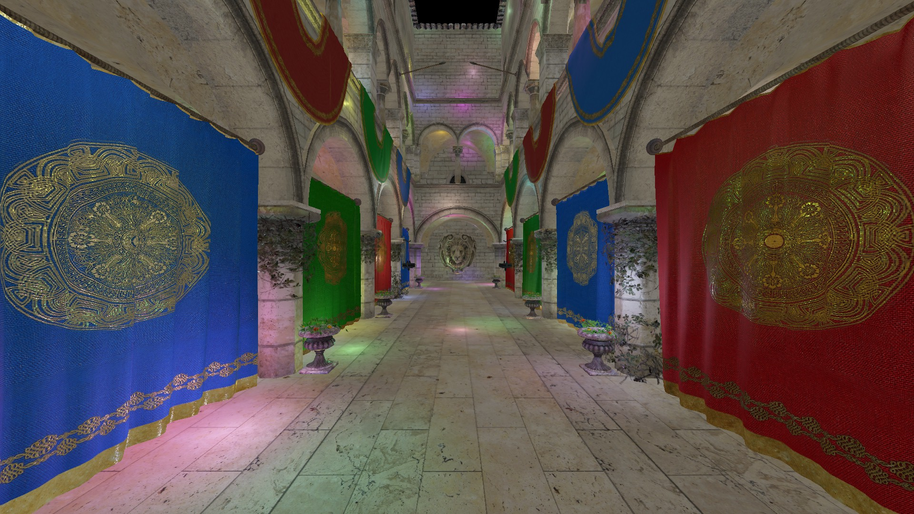
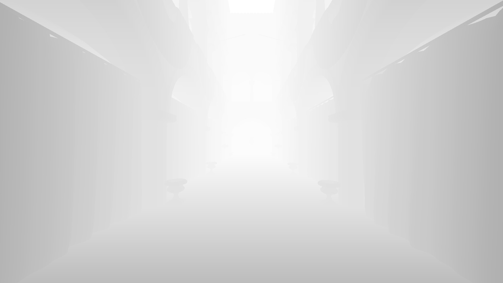
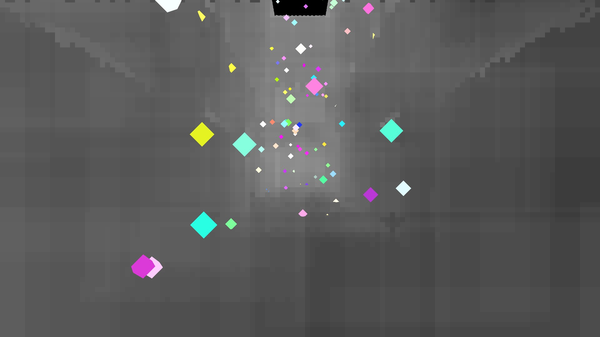
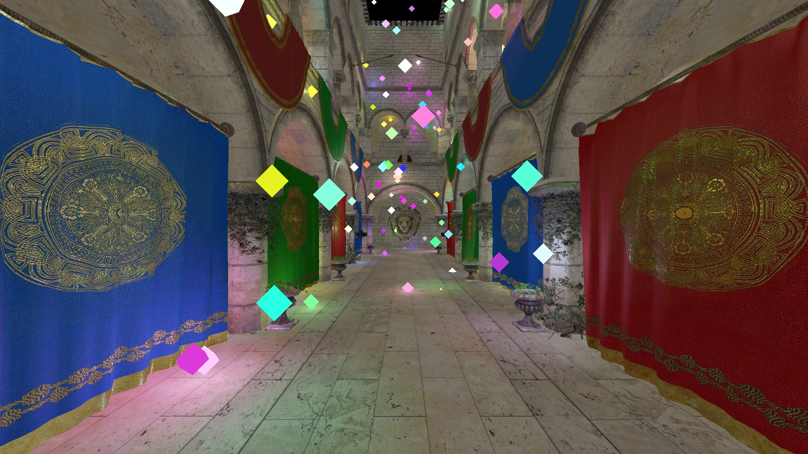

Forward+ Renderer
================

A real-time Forward+ renderer based on the paper
[Forward+: Bringing Deferred Rendering to the Next Level](https://takahiroharada.files.wordpress.com/2015/04/forward_plus.pdf)
by Takahiro Harada, Jay McKee, and Jason C. Yang.



Overview
----

As its name suggests, Forward+ is an extension to traditional forward rendering.  
Before the final shading, a light culling stage is introduced to cull and store lights that contribute to the final pixel.

The rendering consist of 3 pass: the **depth prepass**, the **light culling** and the **final shading**.

### 1. Depth prepass

We fill the depth buffer by rendering the scene geometry without fragment shader.
  


### 2. Light culling

In this pass we split the screen in tile of 16 x 16 pixels and use a compute shader to determine what lights are visible in each tile.  
A workgroup is created for each tile. Within that workgroup, there are 256 threads, one for each pixel in the tile.  
  
The depth buffer generated in the depth prepass is used to determine the min and max depth value within a tile.
A thread calculates the frustum planes for that tile, which will be shared by all threads in the workgroup.

Then each thread calculates in parallel (256 max) whether or not a light is inside the frustum.
The visible light indices are stored back by a single thread into a SSBO (Shader Storage Buffer Object).



### 3. Final shading

For each fragment, we loop through the lights indices stored into the SSBO and accumulate the light contributions using a full direct lighting PBR.  
The resulting color is stored within a HDR buffer and is post-processed in a final shader.


  

Build
----
  
```
git clone --recursive https://github.com/indiedriver/forward_plus_renderer
cd forward_plus_renderer
cmake .
```

### Controls
```
Mouse movement - Orients the camera
W,A,S,D        - Move around
F              - Toggle fullscreen
I              - Toggle debug info HUD  
Q              - Toggle light debug 
E              - Toggle light visibility debug
```
